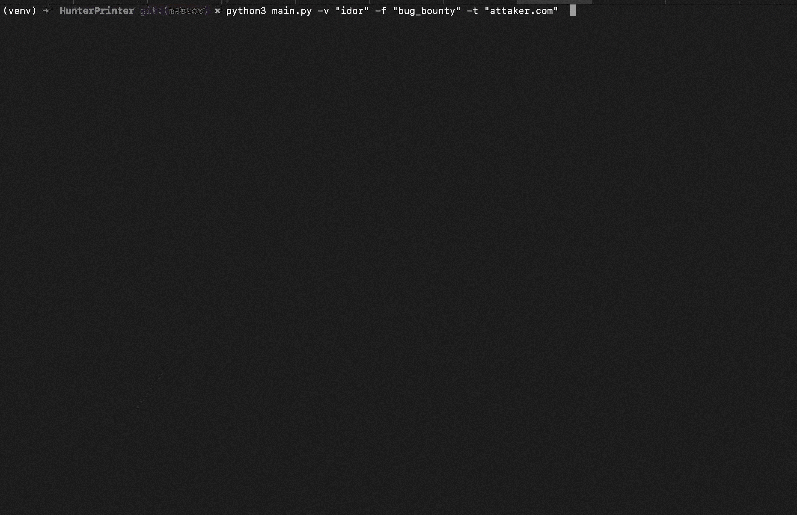

# Hun2race

Hun2race is automating reports tool for bug hunters and penetration testers 
the tools uses GOOGLE BARD to bring up responses for a faster reporet generation 
with the help of LateX for creating templates to generate PDFs 

Note : this is a beta version of the tool 

# Guide  

1. Clone the report `git clone https://github.com/sudobyter-hub/Hun2race.git`
2. Install python requirments `pip install -r requirements.txt`
3. Edit `hun2race.py` file and change API Key, follow instructions [Google BARD-API](#google-bard-key) 
4. Make sure you have [Latex](#latex) installed in your machine ! 
5. Run the tool `python3 hun2race.py -f bug_bounty -v idor -t attacker.com -P "your PoC inhere`

# Google BARD key 
1. Open google bard
2. Sign in to your account
3. View cookies and copy the value of `__Secure-1PSID`
4. Insert the value in hun2race.py

# LaTeX
You must have LateX installed on your machine 

## APT 
`sudo apt-get install texlive-full`

## PACMAN 
`sudo pacman -S texlive-most`

## MAC 
`brew install basictex` 

## WINDOWS 
`choco install texlive`

# Contibutions 
Feel free to contact me 
at sudobyter@gmail.com 
for any suggestions, developement or issues 

